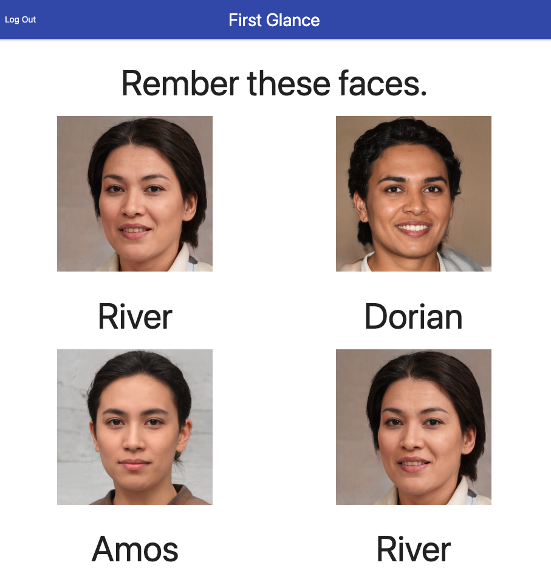

First Glance
--
Challenge yourself to remember new names and new faces. 

Technologies used
--
* Python
* Django
* Pip
* PostgreSQL
* Django-Heroku

Screenshots
--

--
Getting Started
--

Try it out for yourself [here](https://first-glance.herokuapp.com/accounts/login/?next=/)! Create an account or sign in as 

**username:** guest
**password:** djangoguest

See if you can remember all of the faces!

Future Enhancements
--
* Add calls to Generate Photos API.
* Add calls to Generate Names API.
* Create multiple choice version of gameplay.
* Allow user to select how many faces to see.
* Add time limit to group view.
